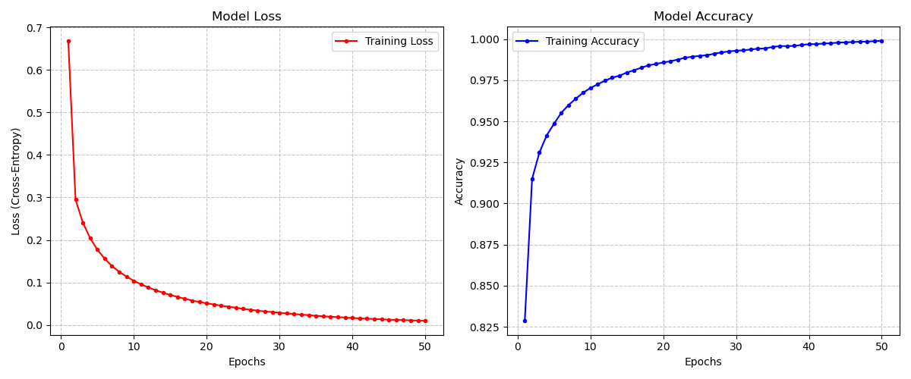
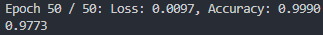

# Workshop A: MLP Implementation with NumPy

source code: <https://github.com/wallace611/MLP-numpy.git>

## Architecture

本次作業中使用 NumPy 手刻多層感知機，並使用 Mnist 資料集來驗證該 MLP 的正確性。

為了簡化模型的複雜度並將功能抽象化，我將整個模型包成 class 並提供以下介面：

```python
model = Model()
model.init_params(layer_dim=[784, 128, 64, 10], activations=[relu, relu, softmax])
model.update_params(learning_rate=0.01)
model.forward(X)
model.backward(Y)
model.loss(AL, Y)
model.accuracy(AL, Y)
model.train(X, Y, epochs=10, batchsize=128, learning_rate=0.01)
```

class 內包含 private 變數 `parameter`, `cache`, `grads` 等，用來模型的參數及計算梯度，在呼叫 `forward` 與 `backward` 時模型會自行維護，因此使用上可以很簡單。例如：

```python
m = Model() 
m.init_params([784, 128, 64, 10], [relu, relu, softmax])
m.train(X_train, Y_train, 100, 128, 0.05)

AL = m.forward(X_test)
print(m.accuracy(AL, Y_test))
```

如此一來我們只需要額外維護 `X`, `Y` 及輸出結果即可，不需要了解內部邏輯。

## Math

這算是本次作業的主要目標，搞懂這東東的數學邏輯。

### 正向傳播

正向傳播我認為比較容易理解，就是將我們的輸入透過矩陣 $W$ 進行線性特徵轉換，利用 $b$ 向量對結果進行平移，最終再利用激勵函數加入非線性的性質。公式如下：

$$
z_l = W_{l\times(l-1)} \times a_{l-1} + b_l =
{}^{dim_{l}} \left \{
    \overbrace{
        \begin{bmatrix}
            & \vdots & \\
            \cdots & W & \cdots \\
            & \vdots &
        \end{bmatrix}
    }^{dim_{l-1}}
\right.
\times
{}^{dim_{l-1}} \left \{
    \begin{bmatrix}
        \vdots \\
        a \\
        \vdots
    \end{bmatrix}
\right.
+
{}^{dim_{l}} \left \{
    \begin{bmatrix}
        \vdots \\
        b \\
        \vdots
    \end{bmatrix}
\right.
$$

$$
a_l=\text{activation}(z_l)
$$

然而正向傳播的結果往往不盡人意，需要對 $W$ 和 $b$ 進一步微調才能達到我們的要求。但具體每個參數要怎麼微調呢？這就需要利用反向傳播來處理。

### 反向傳播

我們的模型有個評估函數，名為 loss function，數值越低代表模型越精準。在反向傳播中我們要透過求導找到所謂的「梯度」，去了解每層的 $W$ 與 $b$ 該如何調整。

$$
\delta_l=(\partial L / \partial a_l) \odot \sigma '_{l}(z_l)
$$
$$
\partial L / \partial W_l=\delta_l \times (a_{l-1})^T
$$
$$
\partial L / \partial b_l=\sum \delta_l
$$

### 梯度下降

求出梯度後，接著使用梯度下降法對每一層的參數進行更新，其中 $\alpha$ 為控制更新步長的學習率：
$$
W_{l\_new}=W_l-\partial L / \partial W_l * \alpha
$$
$$
b_{l\_new}=b_l-\partial L / \partial b_l * \alpha
$$

## Implementation

### 參數初始化

這個函數包含以下功能：

* 初始化 $W$ 與 $b$
* 給定每層的深度及激勵函數

```python
def init_params(self, layer_dim: list, activations: list):
    self._depth = len(layer_dim)
    self._parameters = {}
    for i in range(1, self._depth):
        fan_in = layer_dim[i - 1]
        fan_out = layer_dim[i]
        xavier_scale = np.sqrt(1.0 / fan_in)
        self._parameters[f"W{i}"] = np.random.randn(fan_out, fan_in) * xavier_scale
        self._parameters[f"b{i}"] = np.zeros((fan_out, 1))

    self._activations = [None] + activations.copy()
```

上課時老師就有提到初始化 $W$ 時可以給他一些特殊的數值，不使用純粹的 `np.random.random` 以避免梯度消失的問題。經過查詢之後找到了這個 `xavier_scale`。相比於純隨機數，這樣的做法可以讓正向傳播時，每一層的輸出變異數維持穩定，讓模型初期的收斂可以穩定些。

### 正向傳播

```python
def forward(self, X: np.ndarray) -> np.ndarray:
    if len(X.shape) == 1:
        tmp = X.reshape(-1, 1)
    else:
        tmp = X
    self._cache = {}
    self._cache["A0"] = tmp.copy()
    for i in range(1, self._depth):
        tmp = self._parameters[f"W{i}"] @ tmp + self._parameters[f"b{i}"]
        self._cache[f"Z{i}"] = tmp.copy()
        tmp = self._activations[i](tmp)
        self._cache[f"A{i}"] = tmp.copy()
    return tmp
```

很單純的正向傳播，給出最終結果的同時，也記錄途中所有的 $Z$ 與 $A$。

### Loss & Accuracy

```python
def loss(self, AL: np.ndarray, Y: np.ndarray) -> float:
    return -np.sum(Y * np.log(AL + 1e-8)) / Y.shape[1]

def accuracy(self, AL: np.ndarray, Y: np.ndarray) -> float:
    return np.mean(np.argmax(AL, axis=0) == np.argmax(Y, axis=0))
```

Loss 寫死 Cross-Entropy，因為這次單純只要訓練 Mnist 資料集，並且在寫反向傳播的時候也比較方便。在 `log` 內加入 `1e-8` 以避免 AL 趨近或為 `0` 時導致錯誤。

### 反向傳播

```python
def backward(self, Y: np.ndarray):
    self._grads = {}
    if len(Y.shape) == 1:
        batch_size = 1
        Y = Y.reshape(-1, 1)
    else:
        batch_size = Y.shape[1]
    L = self._depth - 1
    AL = self._cache[f"A{L}"]
    delta = (AL - Y)
    self._grads[f"dW{L}"] = (delta @ self._cache[f"A{L - 1}"].T) / batch_size
    self._grads[f"db{L}"] = np.sum(delta, axis=1, keepdims=True) / batch_size
    for i in range(L - 1, 0, -1):
        delta = (self._parameters[f"W{i + 1}"].T @ delta) * 
            m[self._activations[i]](self._cache[f"Z{i}"])

        self._grads[f"dW{i}"] = delta @ self._cache[f"A{i - 1}"].T / batch_size
        self._grads[f"db{i}"] = np.sum(delta, axis=1, keepdims=True) / batch_size
```

利用所有已知的資訊獲得每一層的梯度。

### 訓練流程

```python
def train(self, 
    X_train: np.ndarray, 
    Y_train: np.ndarray, 
    epochs: int, 
    batch_size: int, 
    learning_rate: float
):
    m = X_train.shape[1]
    
    losses = []
    accuracies = []
    
    for epoch in range(epochs):
        epoch_loss = 0
        epoch_acc = 0
        num_batches = 0
        
        perm = np.random.permutation(m)
        X_shu = X_train[:, perm]
        Y_shu = Y_train[:, perm]
        
        for i in range(0, m, batch_size):
            end_idx = min(i + batch_size, m)
            X_batch = X_shu[ : , i : end_idx]
            Y_batch = Y_shu[ : , i : end_idx]
            AL = self.forward(X=X_batch)
            
            batch_loss = self.loss(AL, Y_batch)
            epoch_loss += batch_loss

            batch_acc = self.accuracy(AL, Y_batch)
            epoch_acc += batch_acc
            
            self.backward(Y_batch)
            
            self.update_params(learning_rate)
            
            num_batches += 1
        
        epoch_loss /= num_batches
        epoch_acc /= num_batches
        
        print(f"Epoch {epoch + 1} / {epochs}: Loss: {epoch_loss:.4f}, Accuracy: {epoch_acc:.4f}")
        losses.append(epoch_loss)
        accuracies.append(epoch_acc)
        
    return losses, accuracies
    
```

採用 Mini-batch 的方式訓練，每開始一次 epoch 時，會打亂資料的順序，減少資料的順序對結果的影響，但有點浪費時間就是了。

## Result

以下是最終的測試程式碼：

```python
def get_datasets():
    print("Fetching datasets...")
    mnist = fetch_openml('mnist_784', version=1, as_frame=False, parser='auto')
    X = mnist.data
    Y_raw = mnist.target.astype(np.int64)
    Y = np.zeros((10, len(Y_raw)))
    Y[Y_raw, np.arange(len(Y_raw))] = 1
    X = (X / 255.0).T
    n = X.shape[1]
    print("Done.")
    return X, Y, n

X, Y, n = get_datasets()
slic = int(n * 6 / 7)
X_train, X_test = X[:, : slic], X[:, slic :]
Y_train, Y_test = Y[:, : slic], Y[:, slic :]

m = Model()
m.init_params([784, 128, 64, 10], [relu, relu, softmax])
losses, accuracies = m.train(X_train, Y_train, 200, 128, 0.05)

AL = m.forward(X_test)
print(m.accuracy(AL, Y_test))
```

我將前 60000 筆資料當作訓練資料，最後 10000 筆做為測試資料，用來測試模型訓練完後是否能正確辨識沒見過的測試資料。

### 訓練結果

#### Training Loss & Accuracy



本次一共訓練 50 epochs，可以看到 loss 顯著降低，而 accuracy 則趨近於 1.0。

#### Test datasets



最終測試資料集得到了 0.9773 的結果，表示模型能夠正確辨識極大部分的資料。

## Reflection

這次使用純手刻的方式利用 NumPy 造出了一個 MLP，並且讓他跑 Mnist 資料集進行訓練。我在寒假時曾經請 Gemini 教我做過類似的事情，但那時我反向傳播的部分看了半天還是無法理解，於是果斷放棄轉而來修這堂課。

在建好模型讓他開始運行的時候，看到他的 loss 竟然真的有在降低，說實話還真的有點感動，有種「我終於搞懂這東西在做甚麼了」的感覺。不過現在是使用 NumPy 因此跑起來比較慢，訓練時大量資料的讀寫也讓我的 RAM 條發出了奇怪的電流聲。期待未來能夠將模型放到 GPU 跑，並學到更多深度學習的相關知識。
